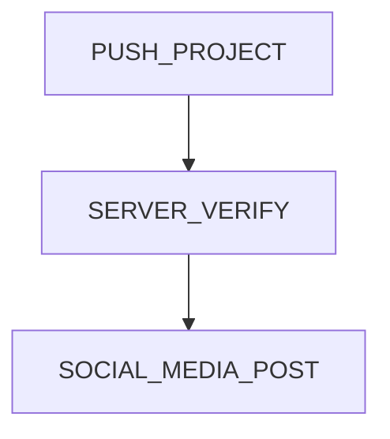

Desafíos de AWS

## Proyectos prácticos
## Debes intentar completar en 7 días:

### Día 1. **Proyecto**: Alojar un sitio web personal
### Día 2. **Proyecto**: Alojamiento de sitios web estáticos
### Día 3. **Proyecto**: Base de datos de estudiantes
### Día 4. **CloudWatch (Monitoreo)**: Configurar alertas
### Día 5. **Facturación y Explorador de Costos**: Aprender a usar la herramienta de exploración de costos

[inspiration](https://www.freecodecamp.org/news/join-the-100daysofcode-556ddb4579e4/)
